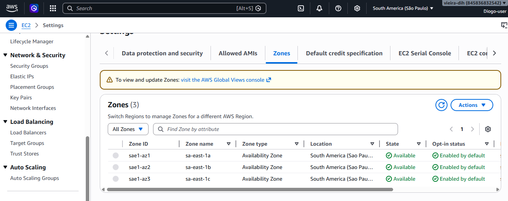
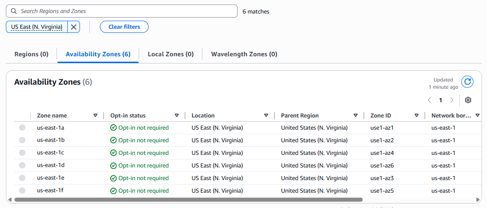
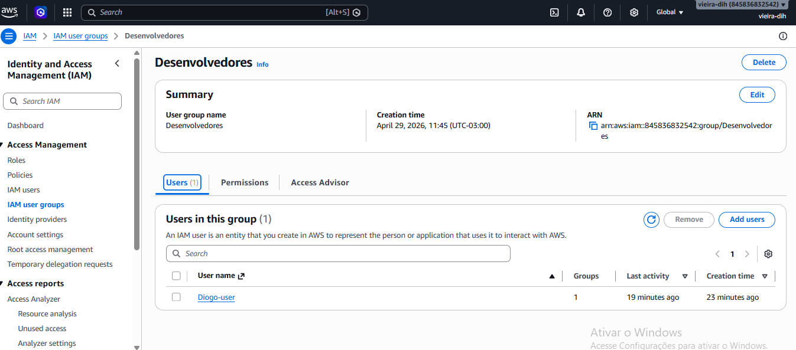
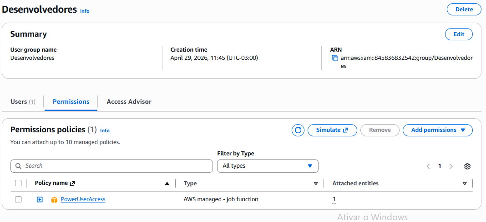
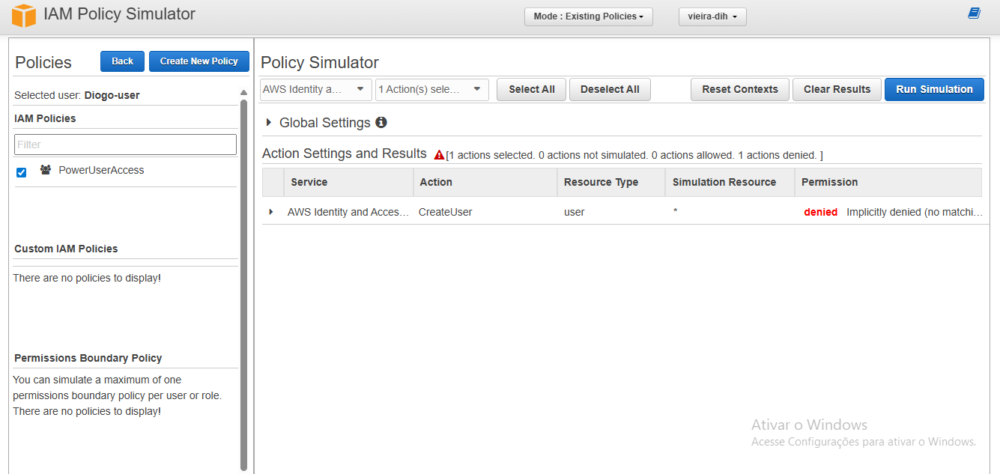

# TF08 - Relatório da Caça ao Tesouro na AWS

## Aluno

- Nome: Diogo Vieira Amorim
- RA: 6324639

---

## Evidências das Missões

### Missão 1: Explorando Zonas de Disponibilidade





---

### Missão 2: Grupo Desenvolvedores





---

### Missão 3: JSON AdministratorAccess

```json
{
  "Version": "2012-10-17",
  "Statement": [
    {
      "Effect": "Allow",
      "Action": "*",
      "Resource": "*"
    }
  ]
}
```

---

### Missão 4 Simulação de Política IAM



